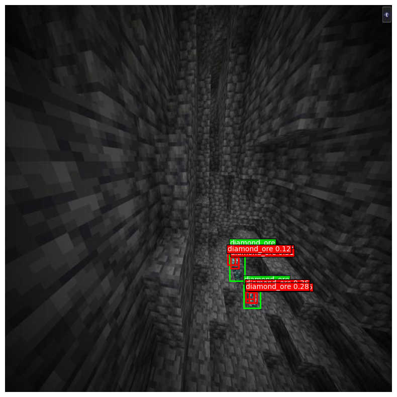

```
________                  ___________.__            .___            
\_____  \_______   ____   \_   _____/|__| ____    __| _/___________ 
 /   |   \_  __ \_/ __ \   |    __)  |  |/    \  / __ |/ __ \_  __ \
/    |    \  | \/\  ___/   |     \   |  |   |  \/ /_/ \  ___/|  | \/
\_______  /__|    \___  >  \___  /   |__|___|  /\____ |\___  >__|   
        \/            \/       \/            \/      \/    \/      
```

<p align="center">
    
</p>

# Implementation of YOLOv5 to detect ores in Minecraft

If you have already mined in Minecraft, you may have found yourself stressing out of fear of walking past valuable ores. With OreFinder, this time is over! OreFinder implements the one-stage object detector YOLOV5(m) v6 [1], trained on a labelled dataset of 3k Minecraft gameplay screenshots.

Project undertaken as part of the INFO8010 course given by Pr. Louppe at ULiège.
Final grade : 15/20.
Note : No copying (even partial) of this code within the scope of the INFO8010 course will be tolerated.

## Dev environment
### Conda installation
```bash
wget https://repo.anaconda.com/miniconda/Miniconda3-latest-Linux-x86_64.sh
bash Miniconda3-latest-Linux-x86_64.sh # Accept everything, say 'yes'...
conda init # Run it in a new terminal
conda create -n info8010
conda activate info8010
conda info --envs #check your conda envs
which python3 # check that the python version is the one from conda (something like /home/username/miniconda3/envs/info8010/bin/python3) 
conda install ipykernel
sudo apt install graphviz
```
When running the notebook, make sure to select the kernel info8010.

## Model links
Official Implementation : https://github.com/ultralytics/yolov5/tree/master/models

YOLOV5 explained: 
- https://iq.opengenus.org/yolov5/
- https://towardsai.net/p/l/yolov5m-implementation-from-scratch-with-pytorch
- https://sh-tsang.medium.com/brief-review-yolov5-for-object-detection-84cc6c6a0e3a
- https://github.com/ultralytics/yolov5/discussions/3181

## Dataset
- YOLOv5: https://universe.roboflow.com/yolo-minecraft/minecraft-ogpjp/dataset/10

## Project links
- Course page: https://github.com/glouppe/info8010-deep-learning
